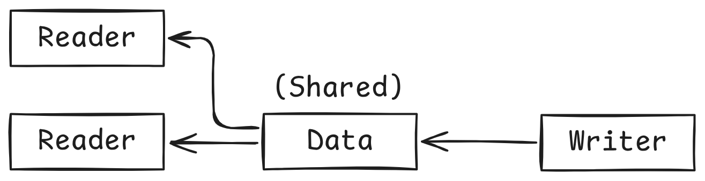

<h1 align="center">Reader Writer Example</h1>

    

# Description
This mini project showcases the implementation of the reader writer principle.
- Multiple readers are allowed to read the data, but only 1 writer can modify the data.
- While the data is modified by the writer, no reader should be allowed to read the data.

In the `Database` class, there consists of 2 readers and 1 writer. Multiple readers can read as the `read()` is not synchronized, allowing multiple threads to execute this function concurrently. Writers uses the `synchronized write()` to change the data. A placeholder data value `9999` is used during the modification, and if a reader manages to read `9999`, then this means the code violates the reader-writer principle.

# `synchronize` Explanation
When you declare an instance method (a non-static method like `write()`, `startRead()`, or `endRead()` in your Database class) as synchronized, Java automatically uses the intrinsic lock associated with the specific instance of the object the method is being called on.

So, when a thread calls `database.write()`, it tries to acquire the lock belonging to that specific database object.
Similarly, when another thread calls `database.startRead()`, it tries to acquire the lock belonging to the exact same database object.